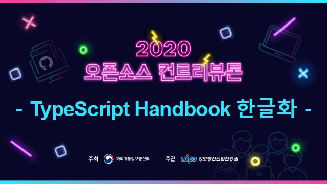

# TypeScript-Handbook 한글 문서

 <!-- ALL-CONTRIBUTORS-BADGE:START - Do not remove or modify this section -->

<!-- ALL-CONTRIBUTORS-BADGE:END -->
<!-- RELEASE-DATE-BADGE:END -->
<!-- STARS-BADGE:END -->

[TypeScript Handbook](https://www.typescriptlang.org/docs/home.html)을 번역하는 프로젝트입니다.

## 진행 상황

번역 진행 상황은 [이곳](https://github.com/typescript-kr/typescript-kr.github.io/projects/1)을 통해 확인할 수 있습니다.

## 참여하기

누구나 참여 가능하며 참여하는 방법은 [CONTRIBUTING.md](https://github.com/typescript-kr/typescript-kr.github.io/blob/master/CONTRIBUTING.md)를 참고해 주세요.

잘못된 번역, 오타, 번역 요청은 [이슈](https://github.com/typescript-kr/typescript-kr.github.io/issues)에 등록 해주시면 감사하겠습니다.

그 밖에도 다양한 의견 및 피드백은 언제나 환영합니다:)

## 2020 오픈소스 컨트리뷰톤 멘티 모집 (2020.6.1 ~ 7.6)
공개 SW 포탈에서 현재 오픈소스 프로젝트 관련해서 멘티를 모집하고 있습니다.  
오픈소스 프로젝트에 기여해 보고자 하는 마음이 있었지만 막상 도전하기 어려우셨다면 2020 오픈소스 컨트리뷰톤 참여를 추천드립니다 😄

[오픈소스 컨트리뷰톤이란?](https://www.oss.kr/contributhon)

Github에 대해 아직 잘 모르시거나  
이제 개발을 시작하는 초보 개발자시거나  
TypeScript에 대해 공부를 하고 싶거나  
TypeScript Handbook에 대해 번역 리뷰를 하고 싶으신 분이 있다면  
강력하게 추천합니다! [신청하기](https://www.oss.kr/contributhon_project/show/0c290a4d-e97d-4281-b5d3-4fbc1cc8b152)

## 컨트리뷰터 목록 ✨

도움 주셔서 감사합니다. ([emoji key](https://allcontributors.org/docs/en/emoji-key)):

<!-- ALL-CONTRIBUTORS-LIST:START - Do not remove or modify this section -->
<!-- prettier-ignore-start -->
<!-- markdownlint-disable -->
<table>
  <tr>
    <td align="center"><a href="https://github.com/yeonjuan/dev-blog"> <b>YeonJuan</b></a> <a href="#translation-yeonjuan" title="Translation">🌍</a></td>
    <td align="center"><a href="https://github.com/Bumkeyy"> <b>Kibeom Kwon</b></a> <a href="#translation-Bumkeyy" title="Translation">🌍</a></td>
    <td align="center"><a href="https://guyeol.github.io"> <b>GuyeolJeong</b></a> <a href="#translation-guyeol" title="Translation">🌍</a></td>
    <td align="center"><a href="https://github.com/dvlprsh"> <b>seoheePark</b></a> <a href="#translation-dvlprsh" title="Translation">🌍</a></td>
    <td align="center"><a href="https://devjang.github.io"> <b>poco.j</b></a> <a href="#translation-devJang" title="Translation">🌍</a></td>
    <td align="center"><a href="http://ysm.sh"> <b>Sungmin Chris Yang</b></a> <a href="#translation-ysm0622" title="Translation">🌍</a></td>
    <td align="center"><a href="https://github.com/publisherKim"> <b>publisherKim</b></a> <a href="#translation-publisherKim" title="Translation">🌍</a></td>
    <td align="center"><a href="https://github.com/yeonggyulim"> <b>Yeonggyu Lim</b></a> <a href="#translation-yeonggyulim" title="Translation">🌍</a></td>
  </tr>
  <tr>
    <td align="center"><a href="https://github.com/urbanscenery"> <b>YeonTaeKIM</b></a> <a href="#translation-urbanscenery" title="Translation">🌍</a></td>
    <td align="center"><a href="https://github.com/taekyunKimDev"> <b>taekyunKimDev</b></a> <a href="#translation-taekyunKimDev" title="Translation">🌍</a></td>
    <td align="center"><a href="https://jiimy.github.io"> <b>rudwn Aiden</b></a> <a href="#translation-jiimy" title="Translation">🌍</a></td>
    <td align="center"><a href="https://github.com/hellomhc"> <b>Myeonghwan Cho</b></a> <a href="#translation-hellomhc" title="Translation">🌍</a></td>
    <td align="center"><a href="https://overcurried.com"> <b> Jaewon Seo</b></a> <a href="#translation-ENvironmentSet" title="Translation">🌍</a></td>
    <td align="center"><a href="https://www.linkedin.com/in/taemin-shin-abba95195/"> <b>Taemin Shin</b></a> <a href="#translation-cprayer" title="Translation">🌍</a></td>
    <td align="center"><a href="https://github.com/badger93"> <b>badger93</b></a> <a href="#translation-badger93" title="Translation">🌍</a></td>
    <td align="center"><a href="https://github.com/kok202"> <b>kok202</b></a> <a href="#translation-kok202" title="Translation">🌍</a></td>
  </tr>
  <tr>
    <td align="center"><a href="https://github.com/ye-geeee"> <b>Yeji Kang</b></a> <a href="#translation-ye-geeee" title="Translation">🌍</a></td>
    <td align="center"><a href="https://github.com/Myoji"> <b>Myoji</b></a> <a href="#translation-Myoji" title="Translation">🌍</a></td>
    <td align="center"><a href="https://heeveloper.github.io/"> <b>Heeveloper</b></a> <a href="#translation-heeveloper" title="Translation">🌍</a></td>
    <td align="center"><a href="https://github.com/bobfull"> <b>bobfull</b></a> <a href="#translation-bobfull" title="Translation">🌍</a></td>
    <td align="center"><a href="https://github.com/lcm6528"> <b>changmin Lee</b></a> <a href="#translation-lcm6528" title="Translation">🌍</a></td>
    <td align="center"><a href="https://github.com/nmsohn"> <b>Hahn</b></a> <a href="#translation-nmsohn" title="Translation">🌍</a></td>
    <td align="center"><a href="https://github.com/33577"> <b>33577</b></a> <a href="#translation-33577" title="Translation">🌍</a></td>
  </tr>
</table>

<!-- markdownlint-enable -->
<!-- prettier-ignore-end -->
<!-- ALL-CONTRIBUTORS-LIST:END -->

[마이그레이션된 프로젝트](https://github.com/yeonjuan/TypeScript-Handbook-ko)의 컨트리뷰터도 포함된 목록 입니다 :)

This project follows the [all-contributors](https://github.com/all-contributors/all-contributors) specification. Contributions of any kind welcome!
